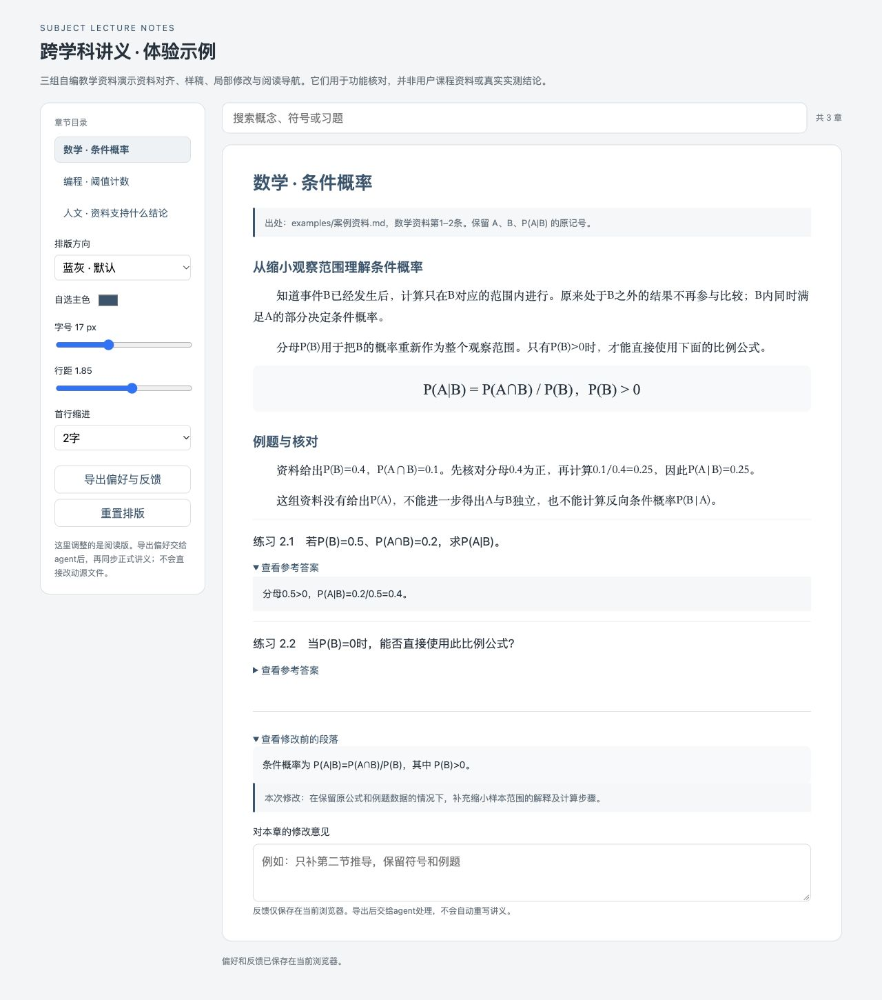

# Subject Lecture Notes

跨学科中文讲义编写 Skill：沿用用户资料记号，展开解释、推导与例题，按完整章节累计交付同一主源和 PDF。

[交互示例](examples/体验示例.html) · [案例资料](examples/案例资料.md) · [资料回执](examples/资料回执.md) · [验证记录](examples/验证记录.md)

GitHub文件页不会直接运行HTML。下载仓库后用浏览器打开 `examples/体验示例.html`，即可使用搜索、换色、字号/行距调整、答案展开、代码复制和反馈导出，无需网络服务。



## 开始使用

将整个目录放入Codex技能目录，保留名称 `subject-lecture-notes`。默认位置为 `~/.codex/skills/subject-lecture-notes/`；设置了 `CODEX_HOME` 时使用其 `skills/` 子目录。已有同名skill时先比较本地修改再更新。

```text
使用 $subject-lecture-notes，根据我提供的PPT编写课程讲义。
面向大一学生，保留PPT里的字母和公式约定，只用我提供的资料。
先给我一段能看出讲解深度与排版的样稿，再按完整章节累计交付。
```

继续或局部修改时可以说：

```text
继续下一章，沿用已确定的资料、符号、深度和版式。
```

```text
只补第二节推导，保留例题、符号和其他段落，给我修改前后对照。
```

## 功能与实现

| 功能 | 使用体验 | 实现 |
|---|---|---|
| 一次设置与偏好复用 | 汇总关键缺项，区分已指定与默认 | 启动约定模板与交互流程 |
| 资料回执与符号表 | 显示已读取范围、原页出处与疑问 | 资料回执模板与资料规则 |
| 真实资料样稿 | 试写代表知识点，按实际反馈调整 | agent工作流程；三组自编案例 |
| 可编辑排版 | 改色、字号、行距、缩进和页边距 | LaTeX模板与排版偏好 |
| 专业语体润色 | humanizer可用时调用，否则内置润色 | 专业润色规则 |
| 局部修改与对照 | 快照、文字差异、恢复预览 | `project_tools.py` |
| 进度与继续工作 | 按章记录实际阶段，重启后保留 | 同上，项目内`.lecture/state.json` |
| 实验结果复用 | 检查输入、输出和环境是否变化 | 同上，文件SHA-256摘要 |
| 阅读导航 | 术语回指、题答链接、搜索与反馈 | LaTeX模板与`build_reader.py` |

工具不会自动理解PPT、生成讲义正文或判定内容质量。提取、视觉核对、写作和实际验证由agent完成；状态记录基于实际工作，不等于检查本身。

## 项目辅助工具

脚本仅依赖Python 3.9+标准库。以下命令在仓库根目录运行，将 `我的讲义` 替换为实际项目路径。

```bash
python3 scripts/project_tools.py init --project 我的讲义
python3 scripts/project_tools.py progress --project 我的讲义
```

初始化只补缺少的约定与偏好文件，保留用户已有编辑。用户可直接改项目中的Markdown文件，agent后续读取并沿用。

修改前创建快照：

```bash
python3 scripts/project_tools.py checkpoint --project 我的讲义 --files 源文件/学科讲义.tex 讲义编写约定.md --note '补充推导前'
```

返回的 `id` 是快照编号，用它查看差异或生成恢复预览：

```bash
python3 scripts/project_tools.py diff --project 我的讲义 --snapshot 快照编号
python3 scripts/project_tools.py restore-preview --project 我的讲义 --snapshot 快照编号
```

恢复预览不覆盖当前文件。根据已授权的回退范围核对后，由agent写回并先保存最新快照；PDF等二进制文件只报告变化，不做逐行文字对照。

实际工作完成后记录阶段：

```bash
python3 scripts/project_tools.py progress --project 我的讲义 --chapter ch01 --title 第一章 --stage 草稿 --next 核对例题与符号
```

阶段包括计划中、草稿、内容已核对、排版已核对、已交付，可用 `--evidence` 附实际检查说明。

实验执行完毕后可记录输入、产物和真实环境标识，再判断是否可复用：

```bash
python3 scripts/project_tools.py cache-record --project 我的讲义 --name experiment01 --files 配套实践/experiment.py 数据/input.csv --outputs 配套实践/result.txt --environment '填入实际解释器和依赖版本'
python3 scripts/project_tools.py cache-check --project 我的讲义 --name experiment01 --environment '填入同一实际环境标识'
```

该工具检查文件一致性，不验证实验是否科学，也不自动识别所有外部环境变化。

## 可选阅读版

```bash
python3 scripts/build_reader.py --input examples/reader-data.json --output 阅读示例.html
```

输入为结构化章节JSON，参考示例的 `chapters`、`sections`、`paragraphs`、`exercises` 等字段。正文与代码以文本渲染，普通文本/Unicode公式可直接显示。复杂LaTeX公式、图示和高保真导出需要进一步适配，不承诺自动无损转换整部PDF。

阅读版的排版偏好与反馈保存在当前浏览器并可导出为JSON或复制文本。浏览器限制自动复制时，会选中文本供手动复制；限制下载时仍可使用文本导出。交给agent映射后才同步正式源文件；页面不会自动改写主源或向外部服务发送反馈。

## 资料原则

主动询问PPT、教材、大纲或笔记，并告知用户严格沿用其中的字母、大小写、上下标、正负号、单位和公式约定。疑似错误与冲突定位说明，集中询问；关键字符不猜测。网络补充按用户的来源边界执行，原资料与补充内容分别记录。

humanizer只润色解释性散文，保留专业语气、事实、公式、引用、代码、限定条件和必要步骤；它不是必装依赖，也不以文本检测器分数判断质量。

## 仓库结构

```text
subject-lecture-notes/
├── SKILL.md
├── README.md
├── agents/openai.yaml
├── assets/       # 启动、资料回执、排版与阅读模板
├── references/   # 按需读取的规则
├── scripts/      # 项目工具与阅读版生成器
├── tests/        # 工具行为核对
└── examples/     # 自编资料、回执、交互示例与验证记录
```

## 设计参考

输入复用参考 [Cookiecutter](https://cookiecutter.readthedocs.io/en/stable/advanced/replay.html)，资料出处参考 [Docling](https://docling-project.github.io/docling/concepts/docling_document/)，阅读工具参考 [Quarto](https://quarto.org/docs/books/book-output.html)，版本评审参考 [Anthropic skills](https://github.com/anthropics/skills/blob/main/skills/skill-creator/eval-viewer/viewer.html)。本仓库实现自己的轻量流程，不要求安装这些项目。

## 发布

将本目录内容作为自己GitHub仓库的根目录提交。作者署名与开源许可证由仓库所有者选择；本版本未预设账号或许可证。
